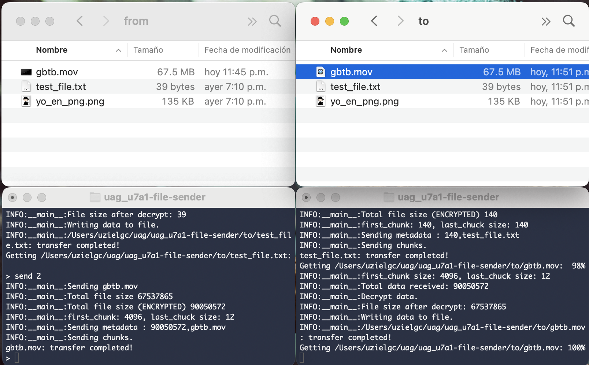
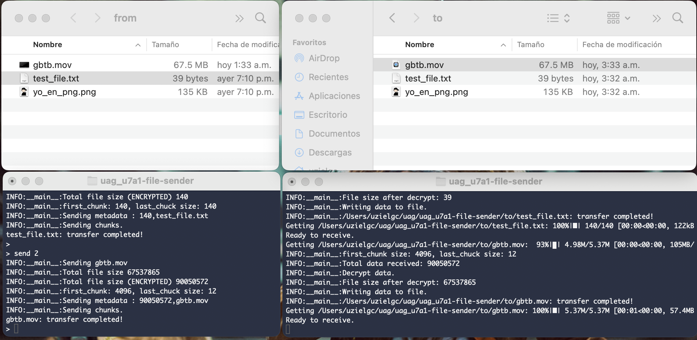

## U7 A1: Envío de archivos

### Author: Eloy Uziel García Cisneros (eloy.garcia@edu.uag.mx)
#### Repo: https://github.com/uzielgc/uag_u7a1-file-sender

## Documentación

```
src/
  |__ node.py

src_v1/
  |-- client.py
  |__ server.py

```

Aplicación basica para envío de archivos entre nodos p2p. 

Cada nodo actua como servidor y cliente para recibir y enviar archivos.
La llave de encriptación se genera con anterioridad y se comparte a cada nodo previo ejecución del servicio.

Para enviar el archivo, este se carga en memoria, se encrypta y se divide en partes, el número de partes se define por CHUNK_SIZE, cada pate es enviada y recibida por el otro nodo, junto con la información del peso total del archivo.
Al recibir todos los bytes se unen y se desencrypta, finalmente se escribe el file en la carpeta destino.

En la versión 1 (primer intento):
Se crea un servidor, al conectarse un cliente, servidor y cliente intercambian llaves de encriptado. El servidor es capaz de listar archivos, y enviarlos con el comando "send <id del archivo>"

La llave publica del cliente es utilizada para encriptar y compartir la llave simétrica. Esta última se transfiere encriptada entre nodos y es utilizada para encriptar y desencriptar los archivos enviados.
-----------------------------------


Al correr el nodo servidor este puede simular comandos como "ls" y "send".

```
ls: lista archivos presentes en el dir "from".
send: Lee, encrypta y envia el archivo al cliente. send <id resultante de ls>
```

El código fuente se encuentra en la carpeta [src](src).

La evidencia en imagenes y/o video se encuentra en la carpeta [media](media).

El código esta comentado en los puntos clave del proceso.

*NOTA: 

### How to Run


```
python src/node.py -p <puerto> -pp <puerto_remoto>
```

e.g.

En dos terminales diferentes (simulando 2 máquinas.)

```
python src/node.py -p 20001 -pp 20002
python src/node.py -p 20002 -pp 20001
```


Version 1 (primer intento.)

Crear server:
```
python src/server.py
```

Inicializar cada uno de los clientes.
```
python src/client.py
```

*NOTA: instalar los requerimientos previo a ejecución:
```
pip install -r requirements.txt
```

[](media/filet2.mov "Video Demo")

* Click en la imagen para ir al video demo. (media/filet2.mov)^

-----------------------------------

Evidencia versión 1

[](media/filet.mov "Video Demo")

* Click en la imagen para ir al video demo. (media/filet.mov)^


Detalle transferencia. 


### Output:

Terminal 1 - nodo1:

```
uzielgc:~$ python src/node.py -p 20001 -pp 20002
INFO:__main__:('127.0.0.1', 20001) -- ('127.0.0.1', 20002)
INFO:__main__:Starting server thread.
INFO:__main__:Starting server. ('127.0.0.1', 20001)
INFO:__main__:Waiting for connection.
INFO:__main__:Starting client (console) thread.
INFO:__main__:Starting client
INFO:__main__:Testing connection.
INFO:__main__:Connected.
Enter command:
> INFO:__main__:Client connected ('127.0.0.1', 62334)
Connected by ('127.0.0.1', 62334)
ls
{
    "0": "yo_en_png.png",
    "1": "test_file.txt",
    "2": "gbtb.mov"
}
> send 0
INFO:__main__:Sending yo_en_png.png
INFO:__main__:Total file size 134695
INFO:__main__:Total file size (ENCRYPTED) 179684
INFO:__main__:first_chunk: 4096, last_chuck size: 3556
INFO:__main__:Sending metadata : 179684,yo_en_png.png
INFO:__main__:Sending chunks.
yo_en_png.png: transfer completed!
Getting /Users/uzielgc/uag/uag_u7a1-file-sender/to/test_file.txt:INFO:__main__:first_chunk size: 140, last_chuck size: 140
INFO:__main__:Total data received: 140
INFO:__main__:Decrypt data.
INFO:__main__:File size after decrypt: 39
INFO:__main__:Writing data to file.
INFO:__main__:/Users/uzielgc/uag/uag_u7a1-file-sender/to/test_file.txt: transfer completed!
Getting /Users/uzielgc/uag/uag_u7a1-file-sender/to/test_file.txt:

> send 2
INFO:__main__:Sending gbtb.mov
INFO:__main__:Total file size 67537865
INFO:__main__:Total file size (ENCRYPTED) 90050572
INFO:__main__:first_chunk: 4096, last_chuck size: 12
INFO:__main__:Sending metadata : 90050572,gbtb.mov
INFO:__main__:Sending chunks.
gbtb.mov: transfer completed!
```


Terminal 2 - nodo2:
```
uzielgc:~$ python src/node.py -p 20002 -pp 20001
INFO:__main__:('127.0.0.1', 20002) -- ('127.0.0.1', 20001)
INFO:__main__:Starting server thread.
INFO:__main__:Starting server. ('127.0.0.1', 20002)
INFO:__main__:Waiting for connection.
INFO:__main__:Client connected ('127.0.0.1', 62333)
Connected by ('127.0.0.1', 62333)
INFO:__main__:Starting client (console) thread.
INFO:__main__:Starting client
INFO:__main__:Testing connection.
INFO:__main__:Connected.
Enter command:
> ls
{
    "0": "yo_en_png.png",
    "1": "test_file.txt",
    "2": "gbtb.mov"
}
Getting /Users/uzielgc/uag/uag_u7a1-file-sender/to/yo_en_png.png:INFO:__main__:first_chunk size: 4096, last_chuck size: 3556
INFO:__main__:Total data received: 179684
INFO:__main__:Decrypt data.
INFO:__main__:File size after decrypt: 134695
INFO:__main__:Writing data to file.
INFO:__main__:/Users/uzielgc/uag/uag_u7a1-file-sender/to/yo_en_png.png: transfer completed!
Getting /Users/uzielgc/uag/uag_u7a1-file-sender/to/yo_en_png.png:

> send 1
INFO:__main__:Sending test_file.txt
INFO:__main__:Total file size 39
INFO:__main__:Total file size (ENCRYPTED) 140
INFO:__main__:first_chunk: 140, last_chuck size: 140
INFO:__main__:Sending metadata : 140,test_file.txt
INFO:__main__:Sending chunks.
test_file.txt: transfer completed!
Getting /Users/uzielgc/uag/uag_u7a1-file-sender/to/gbtb.mov:  98%INFO:__main__:first_chunk size: 4096, last_chuck size: 12
INFO:__main__:Total data received: 90050572
INFO:__main__:Decrypt data.
INFO:__main__:File size after decrypt: 67537865
INFO:__main__:Writing data to file.
INFO:__main__:/Users/uzielgc/uag/uag_u7a1-file-sender/to/gbtb.mov: transfer completed!
Getting /Users/uzielgc/uag/uag_u7a1-file-sender/to/gbtb.mov: 100%
```


Output versión 1

Terminal 1 server:
```
uzielgc:~$ python src/server.py 
INFO:__main__:Listening for incoming connections...
INFO:__main__:Accepted connection from: ('127.0.0.1', 56964)
INFO:__main__:Starting key exchange.
Enter command:
> help
['ls', 'send', 'help']
> ls
{
    "0": "yo_en_png.png",
    "1": "test_file.txt",
    "2": "gbtb.mov"
}
> send 0
INFO:__main__:Sending yo_en_png.png
INFO:__main__:Total file size 134695
INFO:__main__:Total file size (ENCRYPTED) 179684
INFO:__main__:first_chunk: 4096, last_chuck size: 3556
INFO:__main__:Sending metadata : 179684,yo_en_png.png
INFO:__main__:Sending chunks.
yo_en_png.png: transfer completed!
> 
> send 1
INFO:__main__:Sending test_file.txt
INFO:__main__:Total file size 39
INFO:__main__:Total file size (ENCRYPTED) 140
INFO:__main__:first_chunk: 140, last_chuck size: 140
INFO:__main__:Sending metadata : 140,test_file.txt
INFO:__main__:Sending chunks.
test_file.txt: transfer completed!
> 
> send 2
INFO:__main__:Sending gbtb.mov
INFO:__main__:Total file size 67537865
INFO:__main__:Total file size (ENCRYPTED) 90050572
INFO:__main__:first_chunk: 4096, last_chuck size: 12
INFO:__main__:Sending metadata : 90050572,gbtb.mov
INFO:__main__:Sending chunks.
gbtb.mov: transfer completed!
> 
```

Terminal - client:
```
uzielgc:~$ python src/client.py 
INFO:__main__:Setting up socket
INFO:__main__:Connected to the server.
Ready to receive.
Getting /Users/uzielgc/uag/uag_u7a1-file-sender/to/yo_en_png.png:   0%|  | 0.00/43.9k [00:00<?, ?B/s]INFO:__main__:first_chunk size: 4096, last_chuck size: 3556
INFO:__main__:Total data received: 179684
INFO:__main__:Decrypt data.
INFO:__main__:File size after decrypt: 134695
INFO:__main__:Writing data to file.
INFO:__main__:/Users/uzielgc/uag/uag_u7a1-file-sender/to/yo_en_png.png: transfer completed!
Getting /Users/uzielgc/uag/uag_u7a1-file-sender/to/yo_en_png.png: 100%|█| 43.9k/43.9k [00:00<00:00, 2
Ready to receive.
Getting /Users/uzielgc/uag/uag_u7a1-file-sender/to/test_file.txt:   0%|    | 0.00/140 [00:00<?, ?B/s]INFO:__main__:first_chunk size: 140, last_chuck size: 140
INFO:__main__:Total data received: 140
INFO:__main__:Decrypt data.
INFO:__main__:File size after decrypt: 39
INFO:__main__:Writing data to file.
INFO:__main__:/Users/uzielgc/uag/uag_u7a1-file-sender/to/test_file.txt: transfer completed!
Getting /Users/uzielgc/uag/uag_u7a1-file-sender/to/test_file.txt: 100%|█| 140/140 [00:00<00:00, 122kB
Ready to receive.
Getting /Users/uzielgc/uag/uag_u7a1-file-sender/to/gbtb.mov:  93%|▉| 4.98M/5.37M [00:00<00:00, 105MB/INFO:__main__:first_chunk size: 4096, last_chuck size: 12
INFO:__main__:Total data received: 90050572
INFO:__main__:Decrypt data.
INFO:__main__:File size after decrypt: 67537865
INFO:__main__:Writing data to file.
INFO:__main__:/Users/uzielgc/uag/uag_u7a1-file-sender/to/gbtb.mov: transfer completed!
Getting /Users/uzielgc/uag/uag_u7a1-file-sender/to/gbtb.mov: 100%|█| 5.37M/5.37M [00:01<00:00, 57.4MB
Ready to receive.
```


